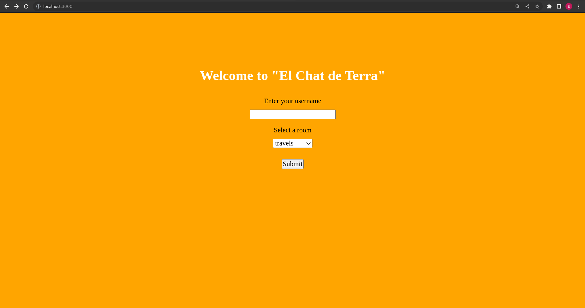
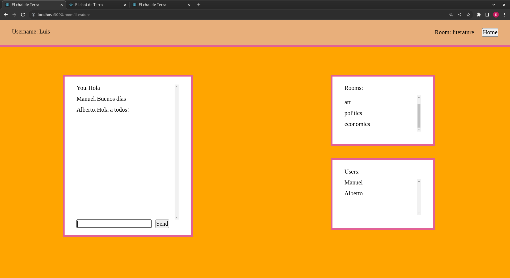

# Chat

## Descripción:

Este proyecto consiste en una aplicación de chat desarrollada con NestJS, React con Typescript y Web Sockets (utilizamos la librería Socket.io).

## Puesta en funcionamiento:

### Backend:

- Para arrancar el backend abriremos nuestra terminal, entraremos dentro del proyecto y accederemos a la carpeta backend.

- Una vez dentro, ejecutaremos el comando < npm i > para instalar todos los paquetes que se encuentres en nuestro package.json.

- Una vez lo tengamos todo instalado ejecutaremos el comando < npm run start:dev > para que nuestro socket quedé abierto en el puerto 5000.

### Frontend:

- Entraremos dentro del directorio frontend.

- Ejecutamos < npm i > para instalar todos los paquetes.

- Ejecutamos el comando < npm start > para que nuestro servidor quede a la escucha en el puerto 3000.

## Utilización:

Una vez nuestro navegador haya descargado la página lo primero que veremos será la pantalla de inicio.

Introduciremos un nombre de usuario y selecionaremons la sala a la que queremos acceder.

Desde este momento, podemos empezar a chatear. Para probar la aplicación sería interesante abrir varias ventanas en el navegador en las que descargemos la página para crear diferentes usuarios y ver cómo interactúan entre ellos.

Se puede apreciar cómo el socket actualiza de manera automática los mensajes y los usuarios que se encuentran dentro de cada sala.
